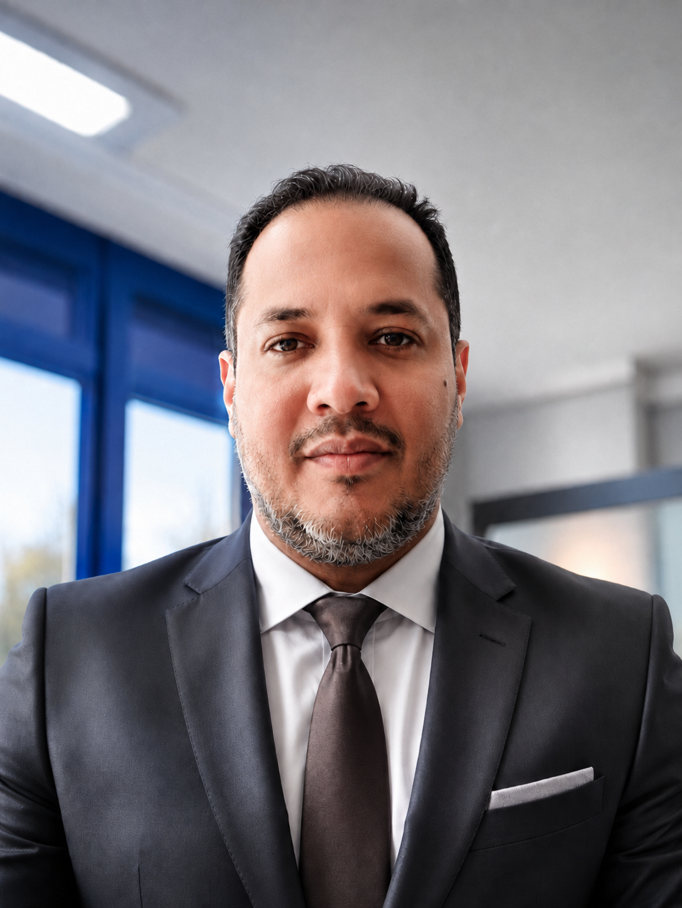

# Johan Andres Cardenas Hernandez

### Full Stack Web Developer | Gas Engineer in Career Transition

📍 Zurich, Schweiz &nbsp;|&nbsp; 📧 tecnogas2010@gmail.com &nbsp;|&nbsp; 📞 +41 76 716 30 19

---

## 🧭 Sobre mí

Ingeniero en Tecnología del Gas con 19 años de trayectoria técnica en la industria petrolera, actualmente en transición hacia el desarrollo de software. Egresado del **Full Stack Developer Bootcamp de 4Geeks Academy**, con experiencia práctica en HTML, CSS, JavaScript, React, Python, Flask, REST APIs, SQLAlchemy, JWT, Git y GitHub.

Mi formación industrial me dio una disciplina analítica, estructurada y resiliente — habilidades que ahora aplico para escribir código limpio, depurar con método y entregar soluciones confiables.

🎯 **Buscando posición como:** Junior Web Developer · Frontend Junior · Backend Junior · IT Support Developer · Full Stack Trainee

---

## 🛠️ Tech Stack

**Frontend**

**Backend**

**Database & Tools**

---

## 🚀 Proyectos destacados

### [Total Muscle App](https://github.com/tecnogas2010-spec/total-muscle-app)
`React` `JavaScript` `Python` `Flask` `SQLAlchemy` `JWT`
- Aplicación full-stack con registro, login, rutas privadas, panel de usuario y funciones de administrador.
- Conexión frontend/backend, gestión de clases, modelos de datos y pruebas locales.

### [Star Wars Blog API](https://github.com/tecnogas2010-spec/sui-starwars-blog-reading-list)
`Python` `Flask` `SQLAlchemy` `REST API`
- Backend con modelos para usuarios, planetas, personajes y favoritos.
- Endpoints GET/POST/DELETE creados, probados y documentados de forma estructurada.

### [JWT Authentication Project](https://github.com/tecnogas2010-spec/Andres-6-Aut-JWT-FR)
`Flask` `React` `JavaScript` `JWT`
- Registro, login y acceso protegido a la API mediante Bearer Token.
- Manejo de tokens en frontend y validación en backend probados.

---

## 💼 Experiencia profesional

**Ingeniero en Tecnología del Gas** — Petróleos de Venezuela S.A. (PDVSA), Refinería Puerto La Cruz · 1997 – 2016
- Soporte técnico de plantas de gas, refinería e instalaciones industriales en entornos críticos de seguridad.
- Apoyo al departamento de mantenimiento en inspecciones, controles técnicos y disciplina de procesos.
- Participación en certificación profesional, seguridad laboral, procedimientos internos y calidad operativa.
- Análisis de fallas técnicas, resolución estructurada de problemas y trabajo en equipos multidisciplinarios.

---

## 🎓 Formación

- **Full Stack Developer Bootcamp** — 4Geeks Academy (dic. 2025 – jun. 2026)
- **Ingeniería en Tecnología del Gas** — Universidad Rafael María Baralt, Venezuela (2008 – 2013)

## 🌐 Idiomas

🇪🇸 Español (nativo) &nbsp;·&nbsp; 🇬🇧 Inglés (B1) &nbsp;·&nbsp; 🇩🇪 Deutsch (A2 zertifiziert, B1 in Ausbildung)

---

📩 ¿Interesado en colaborar o contratarme? Escríbeme a **tecnogas2010@gmail.com**

